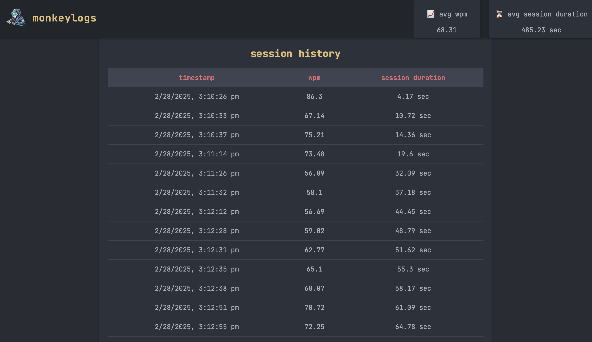

# Hello and welcome to MonkeyLogs! 🎉

MonkeyLogs is a lightweight typing stats tracker and client that runs passively on your computer. It tracks basic stats, and aggregates them into a simple localhost web client for easy access to the unseen part of your day-to-day keyboard sessions. ⌨️




## Foreword ✍️

Hello, my name is Finn (or ooazi), and I really like looking at stats. I find that they’re the best way to visualize the way things work, and I especially love it when they’re easily accesssible, complete with charts and maybe a nice color scheme as the cherry on top of the pie. 🍒
You may be wondering, why did I choose to develop this specifically? 🤔 Truth be told, I’m not really sure. One day I discovered the popular minimalist typing trainer MonkeyType, and loved the way the stats were visualized, and how nicely they were laid out.
I was addicted to those typing tests. I spent hours moving my fingers around my keyboard in specific patterns to output a somewhat arbitrary number I could use to brag to my friends about and sometimes engage in friendly competition. 🏃
Then, I had an epiphany. 💡 I do this every day for regular keyboard use, why can’t MonkeyType just log your regular typing and then give you the stats? They have an API, can I utilize it?
The prototype of this project was originally a client-side API wrapper to MonkeyType, that logged your stats and submitted them through their API. However, this wasn’t sustainable for numerous reasons I really can’t go over while still keeping this brief, but I will give a checklist:
- ✅ The API endpoint I was using was unofficial
- 🔄 I had to mimic the way MonkeyType communicates with its front and back ends
- 🔑 I had to re-authenticate with a bearer token every 30 minutes (and MonkeyType doesn’t have an OAuth for this purpose!)
- 🔒 I had to generate a hash based on quite specific parameters of the test, and MonkeyType’s API sometimes simply would refuse to accept the fudged hash

When I realized MonkeyType itself wasn’t going to cut it for this project, I created MonkeyLogs 2.0: my own all-time version of their wonderful website. 🚀

## Compatibility 🖥️
- macOS: Full compatibility
- Linux: Backend ```(logger.py)``` should work (untested), no support for web app or ANY documentation written
- Windows: Currently no support

Unfortunately, the current version of this program only supports macOS. This is a side project for me, and I don’t have access to Linux or Windows testing platforms.
From looking at the ```logger.py``` file and having prior experience with Linux, I can say with good faith that it should work with Linux, however it is untested and the web app will not work, because I am using gunicorn to deploy a WSGI server, and that only has support for macOS. 🚫

## Stats tracked:
- WPM:
    Words per minute. ⏱️
- Session:
    The stats of the last 10 words you typed. 💬
- Epoch timestamp:
    When the session happened, in milliseconds from January 1st, 1970. ⏳
- Average keystroke time:
    The average time it took you to press one key. ⌨️
- Session Duration:
    How long you were typing those 10 words for. ⌚
- Keys Leaderboard:
    The top 5 keys you were frequently typing. 🏆

## Installation 🛠️

The MonkeyLogs client runs fully local, and is written in Python for easy installation. 🐍

#### WARNING: THIS IS NOT A KEYLOGGER. MONKEYLOGS DOES NOT STORE THE WORDS YOU TYPE. THIS PROJECT IS OPEN-SOURCE FOR A REASON. HOWEVER, THE FOLLOWING STEP CAN POTENTIALLY LET OUTSIDE PROGRAMS HARM THE INTEGRITY OF YOUR SYSTEM. ⚠️

### Step One: Disable SIP (Apple’s System Integrity Protection) 🔒

This step is required for MonkeyLogs to be able to function properly.
Unfortunately, due to the restrictive nature of macOS, your system highly safeguards your system files, including the files utilized by MonkeyLogs to generate reports on your typing statistics and I have not found an exploit to this step yet.
The only way around these safeguards is to fully disable SIP, or the System Integrity Protections Apple put in place in order to protect your computer from bad actors or malware. 🔓

To do this on Apple Silicon (M1 Mac chip or later generations), you will first need to fully power down your computer. A restart will not work for this, because Apple requires a specific form of authentication in order to be able to make these major changes to your system. 🔌
Once you have powered down, you need to start back up again, but keep holding the power button once you see the Apple logo.
If you have done this step correctly, you should see a prompt that says:
```bash
Keep holding to enter Recovery Mode...
```

Eventually, your Mac will restart once again and boot into Recovery mode. 🔄
Once you have entered Recovery mode, you will be greeted with a user login screen. Enter your password and proceed.
You will then see a menu with multiple options, including Disk Utility and backup from a copy of an existing operating system. None of these are relevant to us.
You will need to enter the keyboard shortcut to launch a terminal, or:

```keyboardshortcut
Cmd+Shift+T
```

Once you have done this, you need to type the following command:

```bash
csrutil disable
```

If done correctly, your computer will warn you that this fully disables SIP on your computer and will ask you if you are sure you want to do this. Accept and enter your password.
It will likely take a little bit, but the terminal will eventually notify you that SIP has been disabled. Once it does, restart your computer back into macOS. 🔁

### Step Two: Install Required Dependencies ⚙️

MonkeyLogs relies on many different Python and Homebrew libraries to run. You will need to run the following commands to install them:

```bash
/bin/bash -c "$(curl -fsSL https://raw.githubusercontent.com/Homebrew/install/HEAD/install.sh)"
brew install pipx git 
git clone https://github.com/ooazi/MonkeyLogs
cd monkeylogs 
pip3 install --break-system-packages -r requirements.txt
pipx install .
```

Here is a basic breakdown of what this command sequence actually does:
- ```/bin/bash -c "$(curl -fsSL https://raw.githubusercontent.com/Homebrew/install/HEAD/install.sh)"```:
    Installs Homebrew, the macOS equivalent of a Linux package manager to your computer. 🏠
- ```brew install pipx git```:
    Uses Homebrew to install git (the backend of GitHub), and pipx, a virtual environment package manager. 🔧
- ```git clone https://github.com/ooazi/MonkeyLogs```:
    Installs a copy of the MonkeyLogs GitHub repository to your machine. 📥
- ```cd monkeylogs```:
    Enters the new MonkeyLogs directory. 📂
- ```pip3 install --break-system-packages -r requirements.txt```:
    Force installs the dependencies that MonkeyLogs has stated it needs to function. 📦
- ```pipx install .```:
    Installs the MonkeyLogs CLI (Command Line Interface) tool to your terminal. ⌨️

###  Step Three: Make Sure The Stat Tracker Runs ✅

Now that you have used the above command sequence to install all of the required dependencies, and to install MonkeyLogs onto your path, you now need to complete the final step of your installation.
This step involves adding the ```logger.py``` file found in your MonkeyLogs installation to your macOS login scripts, so it can run in the background and collect your typing stats.

Your ```logger.py``` file can be found at ```~/monkeylogs/logger.py```. This is the file that actually collects the stats and saves them.
In order to add this to your Login Items, you need to first go to:

```
Settings -> Login Items & Extensions -> Open at Login 
```

From there you need to go to your ```logger.py``` file and add it to the list of login items. You will need to authenticate for this, enter your password and confirm. 🔐

The last step is to log out, and log back in. Now, your MonkeyLogs client should be running, and tracking your stats every session (10 words) you type. Happy keyboarding! 🎉⌨️

## Usage 🚀

### Basic Usage

MonkeyLogs comes with a pre-installed Flask web app that provides convenient online access to your typing statistics. 🌐
To initialize the web app and view your stats, open a terminal and type:
```bash
monkeylogs start
```

This should output a result of:
```bash
Starting MonkeyLogs server on http://127.0.0.1:5000
✅ MonkeyLogs server started successfully!
```
Once you receive this message, enter a web browser and navigate to ```http://127.0.0.1:5000```. Here lie a basic (but readable and nicely formatted) overview of your typing statistics. 📊

To close the web app, type:

```bash
monkeylogs stop
```

This should output:
```bash
✅ MonkeyLogs server stopped.
```
It is highly recommended to stop the MonkeyLogs web app immediately after viewing, especially if you are on public Wi-Fi, because this can interfere with the operations of the public network and make your typing statistics available to anyone on your network. ⚠️

### Advanced Usage

MonkeyLogs stores statistical data in a jsonc file called log. This file can be located at ```~/monkeylogs/log/log.jsonc```. This file is completely public to anyone that views it, so if you as the user would like to do your own data science experiments or deep-dives into this info, feel free to knock yourself out. 🔍

The file’s structure looks like this:
```json

{
    "sessions": [
        {
            "timestamp": 1740773426,
            "total_keystrokes": 30,
            "wpm": 86.3,
            "session_duration": 4.17,
            "avg_keystroke_time": 0.144,
            "most_used_keys": {
                "e": 4,
                " ": 3,
                "n": 3,
                "\u007f": 3,
                "r": 2
                }
            ]
        }
}
```
### Breakdown
There is a main json bracket, then a sub-bracket titled sessions, which contains all of the sessions (10 word increments) you have tracked.
Within sessions, you have multiple fields of your tracked stats.
- ```timestamp```:
    This is the epoch time that the session occurred. Epoch time is the time in milliseconds since January 1st, 1970 at 12:00 AM. This is the standard time that computers use to track dates, and also the way that the Y2K problem was circumvented. ⏱️
- ```total_keystrokes```:
    This is the amount of keys you have pressed within the 10 word session. ⌨️
- ```wpm```:
    This is your words per minute count, the standard way to track typing speed. ⚡
- ```session_duration```:
    This is how long the session took, in seconds. ⏳
- ```avg_keystroke_time```:
    This is how long it took you, on average, to press one key within the 10 word session. ⌨️
- ```most_used_keys{}```:
    This is a dictionary of the top 5 keys you were pressing during that session. 🏆

You can also use the MonkeyLogs CLI to display an overview of your statistics if you do not wish to open the web app, or have no internet.
To do this, simply run:
```bash
monkeylogs show-stats
```

This will output a compact, text-based overview of your typing statistics.

```bash
📊 MonkeyLogs Typing Statistics
- 🏃 Avg WPM: 66.5
- ⏳ Avg Session Duration: 2879.33 sec
- 📂 Total Sessions: 1059

📝 Recent 5 Sessions:
  - 66.4 WPM  | 5719.8 sec  | 2025-02-28 22:25:29
  - 66.42 WPM | 5723.76 sec | 2025-02-28 22:25:54
  - 66.42 WPM | 5728.66 sec | 2025-02-28 22:25:59
  - 66.42 WPM | 5734.72 sec | 2025-02-28 22:26:22
  - 66.38 WPM | 5743.02 sec | 2025-02-28 22:26:30
  ```
